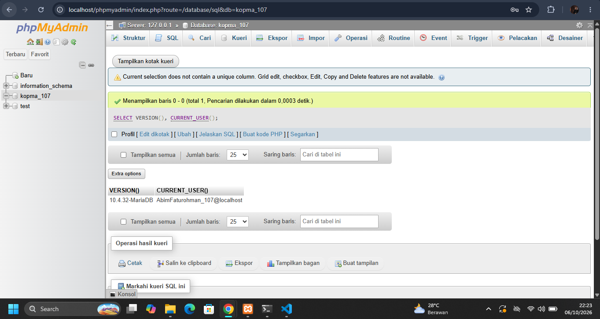
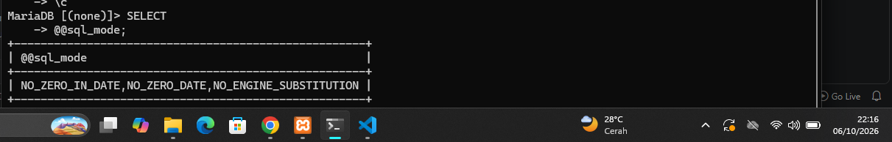
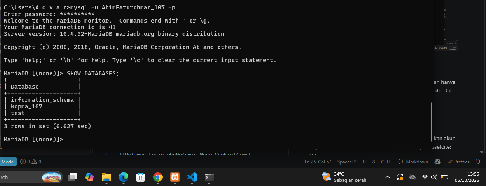
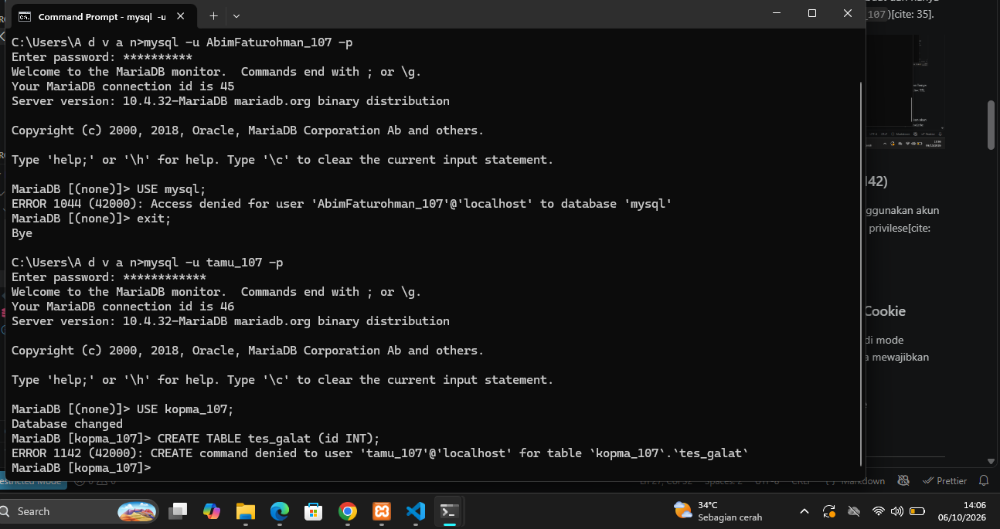
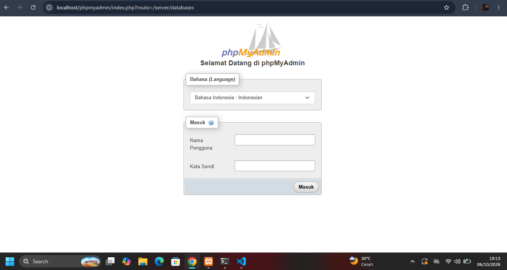
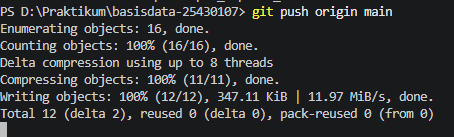

# Laporan Praktikum Basis Data - Pertemuan 1
Nama    :   Abim Faturohman  

NPM     :    25430107 

Kelas   :  D

## 1. Tujuan Praktikum
1. Menjalankan dan menghentikan layanan MariaDB melalui XAMPP Control Panel serta membaca status dan port-nya[cite: 29].
2. Terhubung ke server MariaDB melalui CLI dan phpMyAdmin, serta memahami perbedaan keduanya[cite: 29].
3. Mengamankan akun root dengan password dan membuat akun kerja dengan hak akses terbatas[cite: 29].
4. Membuat basis data pertama dan mencatat pekerjaan ke repositori Git/GitHub[cite: 29].

## 2. Ringkasan Dasar Teori
DBMS (Database Management System) adalah perangkat lunak yang mengelola penyimpanan, keamanan, dan pemrosesan data melalui bahasa SQL[cite: 29]. MariaDB bekerja dengan arsitektur klien-server menggunakan proses `mysqld` di port 3306[cite: 30]. Klien seperti CLI (`mysql`) atau phpMyAdmin mengirimkan perintah SQL ke server[cite: 30]. Prinsip keamanan utama yang diterapkan adalah hak akses minimum (*least privilege*), yaitu mengamankan akun `root` dan menggunakan akun kerja terbatas untuk kebutuhan harian[cite: 32].

## 3. Hasil Langkah Percobaan
### 3.1 Verifikasi Versi Server dan Mode SQL
Server MariaDB berhasil diakses melalui CLI dan mode ketat SQL terkonfigurasi.

### 3.2 Tampilan Hak Akses Akun Kerja
Akun kerja `AbimFaturohman_107` berhasil dibuat dan hanya memiliki akses ke basis data miliknya (`kopma_107`)[cite: 35].

### 3.3 Penolakan Akses (Galat 1044 / 1142)
Percobaan mengakses basis data `mysql` menggunakan akun kerja ditolak oleh server karena tidak memiliki privilese[cite: 35].

### 3.4 Otentikasi phpMyAdmin Mode Cookie
Konfigurasi phpMyAdmin telah diubah menjadi mode `cookie` pada file `config.inc.php` sehingga mewajibkan login sebelum masuk[cite: 36].

## 4. Jawaban Titik Analisis

### Titik Analisis 1: Label MySQL vs Server MariaDB
* **Alasan Analisis:** XAMPP menggunakan MariaDB sebagai pengganti MySQL sejak versi lama, namun label tombol di GUI Control Panel tetap bertuliskan "MySQL" demi kompatibilitas.
* **Konsekuensi & Relevansi Dokumentasi:** Untuk sintaks SQL standar (seperti `SELECT`, `CREATE TABLE`), dokumentasi MySQL dan MariaDB sama-sama relevan[cite: 21]. Namun, ketika menangani fitur spesifik (seperti variabel sistem, tipe engine, atau perbaikan error tertentu), kita wajib merujuk ke dokumentasi resmi MariaDB 10.4[cite: 21, 33].

### Titik Analisis 2: Membaca Pesan Error 1045
* **Alasan Analisis:** Saat menjalankan `mysql -u root` tanpa opsi `-p`, muncul `ERROR 1045 (28000): Access denied for user 'root'@'localhost' (using password: NO)`[cite: 35, 39].
* **Penjelasan Frasa:** Frasa `(using password: NO)` artinya klien mengirim permintaan koneksi ke server tanpa membawa password sama sekali, padahal akun `root` sudah diberi password[cite: 39]. Perbaikannya adalah menggunakan perintah `mysql -u root -p` agar klien meminta input password[cite: 34, 39].

### Titik Analisis 3: Perbedaan Akses Database & Kode Galat (1044 vs 1045 vs 1142)
* **Alasan Analisis `information_schema` vs `mysql`:** Database `information_schema` adalah kamus data (*metadata*) global yang hanya bersifat *read-only* bagi semua user[cite: 34, 35]. Sedangkan database `mysql` berisi tabel kredensial dan otorisasi internal server, sehingga user biasa ditolak[cite: 34, 35].
* **Perbedaan Kode Galat:**
  * **ERROR 1045:** Kegagalan Autentikasi (Password salah atau tidak dikirim saat login)[cite: 39].
  * **ERROR 1044:** Kegagalan Otorisasi Akses Database (Berhasil login, tetapi user tidak berhak membuka database tersebut)[cite: 35].
  * **ERROR 1142:** Kegagalan Otorisasi Eksekusi Perintah (Berhasil buka database, tetapi user tidak berhak menjalankan perintah tertentu, seperti `CREATE TABLE` atau `DROP`).

### Titik Analisis 4: Keamanan Mode Cookie vs Mode Config pada phpMyAdmin
* **Alasan Analisis:** Mode `config` menyimpan kata sandi secara teks polos (*plain text*) di dalam file `config.inc.php` server, sehingga siapa pun yang membuka browser bisa langsung masuk sebagai `root` tanpa otentikasi[cite: 36]. Mode `cookie` jauh lebih aman karena mewajibkan pengguna mengetik nama user dan password setiap kali sesi baru dibuka, serta menyimpan kredensial terenkripsi di cookie browser[cite: 36].

## 5. Hasil Latihan dan Modifikasi
Telah dibuat akun `tamu_107` yang hanya diberi hak `SELECT` pada basis data `kopma_107`. Saat akun tersebut menjalankan perintah `CREATE TABLE uji (id INT);`, server menolak dengan pesan `ERROR 1142 (42000): CREATE command denied to user 'tamu_107'@'localhost' for table 'uji'`[cite: 37].

## 6. Tugas Mandiri: Milestone Proyek 1
1. **Basis Data Proyek:** Dibuat basis data `perpus_107` dengan karakter set `utf8mb4_unicode_ci`[cite: 37].
2. **Akun Pengembang:** Akun `dev_107` dibuat dan hanya memiliki akses penuh pada `perpus_107`[cite: 37].
3. **README.md:** Memuat identitas praktikan, tema Perpustakaan, nama organisasi "Perpustakaan Abim Starlight (AF)", dan deskripsi singkat layanan[cite: 38].
4. **.gitignore:** Dikonfigurasi untuk mengecualikan berkas sensitif (`*.env`, `kredensial*.txt`)[cite: 38].

## 7. Pembahasan dan Kendala
* **Kendala:** phpMyAdmin menampilkan error 1045 setelah password `root` diubah via CLI[cite: 35, 39].
* **Solusi/Penyebab:** phpMyAdmin masih menggunakan konfigurasi lama (mode `config`)[cite: 39]. Masalah teratasi setelah mengubah `$cfg['Servers'][$i]['auth_type'] = 'cookie';` pada file `C:\xampp\phpMyAdmin\config.inc.php`[cite: 36].

## 8. Kesimpulan
Lingkungan kerja MariaDB pada XAMPP dan kendali versi Git/GitHub berhasil dikonfigurasi[cite: 29]. Penerapan prinsip hak akses minimum (*least privilege*) melalui pemisahan akun kerja (`AbimFaturohman_107` dan `dev_107`) serta pengamanan otentikasi phpMyAdmin berhasil melindungi basis data sistem dari akses sembarangan[cite: 29, 32, 35, 36].

## 9. Pernyataan Penggunaan AI
Asisten AI digunakan sebesar **±25%** dari total pengerjaan modul ini. AI dimanfaatkan khusus untuk mendrafkan struktur kerangka laporan Markdown, membantu merumuskan poin analisis perbedaan kode galat (1044, 1045, 1142), dan memberikan referensi sintaks Markdown[cite: 17, 24, 25]. Seluruh eksekusi perintah SQL di terminal, pengaturan file lokal, pembuatan repositori, dan pengambilan *screenshot* dilakukan secara langsung oleh praktikan[cite: 17, 24, 28].

## 10. Bukti Git
* **Tautan Repositori:** `https://github.com/Abimfath/basisdata-25430107`[cite: 24]
* **Hash Commit Pertama:** `d8d20e5 (HEAD -> main, origin/main) p01: inisialisasi repositori dan skrip lingkungan`[cite: 24]
* **Pesan Commit:** `p01: inisialisasi repositori dan skrip lingkungan`[cite: 37]

## Checklist
- [x] Identitas (Nama, NIM, Kelas, Pertemuan 1, Tanggal)[cite: 23]
- [x] Tujuan Praktikum ditulis ulang[cite: 23]
- [x] Ringkasan dasar teori pemahaman sendiri[cite: 23]
- [x] Tangkapan layar langkah percobaan lengkap beridentitas NIM dan jam sistem[cite: 23, 28]
- [x] Jawaban Titik Analisis 1-4 dijawab lengkap dengan alasan[cite: 23, 26]
- [x] Hasil Latihan E (skrip dan bukti galat 1142)[cite: 23, 37]
- [x] Tugas Mandiri Milestone Proyek 1 (`perpus_107`, `dev_107`, README, .gitignore)[cite: 24, 37, 38]
- [x] Pembahasan dan kendala teknis[cite: 24]
- [x] Kesimpulan[cite: 24]
- [x] Pernyataan Penggunaan AI (tercantum porsi 25%)[cite: 24]
- [x] Bukti Git (Tautan repositori dan hash commit)[cite: 24]