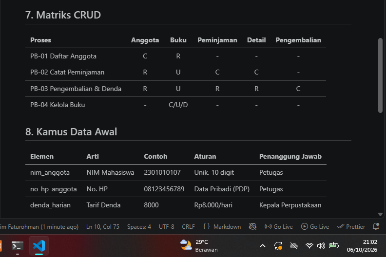

# Laporan Praktikum Basis Data - Pertemuan 2
**Nama:** Abim Faturohman  
**NIM:** 25430107  
**Kelas:** D    

## 1. Tujuan Praktikum
1. Mengidentifikasi aktivitas organisasi, aktor, dan proses bisnis dari narasi dan dokumen sumber.
2. Menurunkan elemen data, entitas kandidat, dan aturan bisnis.
3. Menyusun matriks CRUD dan kamus data awal dengan penanggung jawab data.
4. Menuliskan pernyataan kebutuhan data dan kebutuhan informasi yang spesifik dan dapat diuji.

## 2. Ringkasan Dasar Teori
Analisis kebutuhan merupakan tahap awal dari siklus perancangan basis data sebelum desain konseptual (ERD) dan fisik. Data dipandang sebagai aset organisasi yang harus dikelola tata kelolanya (data governance). Pengelompokan kebutuhan terbagi menjadi kebutuhan data, kebutuhan informasi, aturan bisnis, dan kebutuhan non-fungsional. Matriks CRUD digunakan untuk memastikan seluruh entitas terakomodasi oleh proses bisnis tanpa ada entitas yatim.

## 3. Hasil Langkah Percobaan
Telah diselesaikan analisis studi kasus Kopma pada berkas `p02_kebutuhan_data_kopma_107.md`.

## 4. Jawaban Titik Analisis
* **Titik Analisis 1:** Harga barang pada nota tetap perlu disimpan saat transaksi (AB-04) karena harga barang pada tabel katalog dapat berubah naik/turun di masa depan. Jika nota tidak menyimpan harga transaksi saat itu, laporan omzet masa lalu akan berubah dan menjadi tidak akurat.
* **Titik Analisis 2:** Subtotal dan total adalah nilai turunan. Alasan tidak menyimpannya adalah untuk menghindari anomali inkonsistensi data jika qty/harga berubah. Alasan menyimpannya adalah untuk mempercepat performa pembacaan laporan (query) pada data historis yang sangat besar.
* **Titik Analisis 3:** Pada matriks CRUD Kopma, entitas Pemasok tidak memiliki huruf 'C' (Create). Artinya, ada proses bisnis yang terlewat yaitu "Pengelolaan Data Pemasok". Proses tersebut harus ditambahkan agar entitas Pemasok dapat dibuat.

## 5. Hasil Latihan dan Modifikasi
Perbaikan pernyataan kebutuhan kabur menjadi dapat diuji:
1. **Kabur:** "Data anggota harus aman."
   **Dapat Diuji:** "Nomor HP anggota hanya boleh diakses oleh Kepala Perpustakaan dan disembunyikan dari tampilan kasir."
2. **Kabur:** "Sistem harus cepat mencari barang."
   **Dapat Diuji:** "Pencarian buku berdasarkan kode atau judul harus menampilkan hasil kurang dari 1 detik untuk 10.000 data."
3. **Kabur:** "Laporan stok harus akurat."
   **Dapat Diuji:** "Sistem menolak transaksi peminjaman jika stok buku tersedia bernilai 0."

## 6. Tugas Mandiri: Milestone Proyek 2
Telah disusun berkas dokumen kebutuhan data proyek perpustakaan pada `p02_kebutuhan_data_107.md` dengan parameter $P = 8$.

## 7. Pembahasan dan Kendala
* **Kendala:** Membedakan antara proses bisnis dengan entitas kandidat.
* **Solusi:** Memastikan entitas diwakili kata benda (misal: "Peminjaman"), sedangkan proses diwakili kata kerja (misal: "Mencatat Peminjaman").

## 8. Kesimpulan
Tahap analisis kebutuhan data berhasil memetakan proses bisnis perpustakaan menjadi aturan bisnis yang konkret, matriks CRUD yang seimbang, dan kamus data yang siap ditransformasikan ke bentuk diagram ERD pada modul berikutnya.

## 9. Pernyataan Penggunaan AI
Penggunaan AI (Gemini) dimanfaatkan sebesar **±25%** untuk membantu menyusun kerangka dokumen Markdown, memeriksa perhitungan parameter P, dan memberikan contoh analisis perbaikan pernyataan kebutuhan kabur.

## 10. Bukti Git
* **Tautan Repositori:** `https://github.com/Abimfath/basisdata-25430107`
* **Hash Commit:** `9c96816 (HEAD -> main, origin/main) p02: menyelesaikan dokumen kebutuhan data proyek dan laporan modul 2